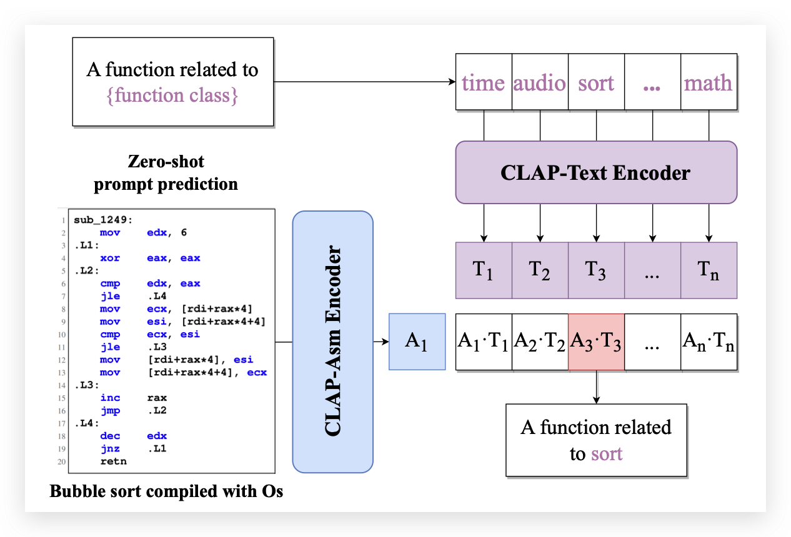

<h1 align="center">CLAP: Learning Transferable Binary Code Representations with Natural Language Supervision</h1>

<h4 align="center">
<p>
<a href=#about>About</a> |
<a href=#news>News</a> |
<a href=#quickstart>QuickStart</a> |
<a href=#details>Details</a> |
<a href=#citation>Citation</a>
<p>
</h4>

## About
CLAP (Contrastive Language-Assembly Pre-training) is a framework that learns binary code representations through natural language supervision. By aligning binary code with natural language explanations, it improves analysis performance in few-shot and zero-shot scenarios. Utilizing a dataset engine capable of automatically generating 195 million pairs of code snippets and their descriptions, CLAP offers a method with exceptional transferability in the field of binary code analysis. Our goal is to provide an effective tool for researchers and practitioners in binary code analysis, with our models accessible on the Hugging Face Model Hub.



## News

- [2024/2/29] CLAP is available on Hugging Face Model Hub ([clap-asm](https://huggingface.co/hustcw/clap-asm) and [clap-text](https://huggingface.co/hustcw/clap-text)).
- [2024/2/28] CLAP is now on [ArXiv](https://arxiv.org/abs/2402.16928).

## QuickStart

This document will help you set up and start using the CLAP model for various tasks, including fine-grained classification of sorting algorithms, malware, and cryptographic algorithms without any further training.

### Requirements
- Python 3.6 or higher
- [PyTorch](https://pytorch.org/get-started/locally/)
- [Transformers library](https://huggingface.co/docs/transformers/installation)
- A CUDA-enabled GPU is highly recommended for faster processing.

Ensure you have Python and PyTorch installed on your system. Then, install the Transformers library using pip:
```bash
pip install transformers
```

### Preparing Tokenizers and Models
Import necessary libraries and initialize the model and tokenizers:
```python
import torch
from transformers import AutoModel, AutoTokenizer

device = torch.device("cuda" if torch.cuda.is_available() else "cpu")

asm_tokenizer = AutoTokenizer.from_pretrained("hustcw/clap-asm", trust_remote_code=True)
text_tokenizer = AutoTokenizer.from_pretrained("hustcw/clap-text", trust_remote_code=True)
asm_encoder = AutoModel.from_pretrained("hustcw/clap-asm", trust_remote_code=True).to(device)
text_encoder = AutoModel.from_pretrained("hustcw/clap-text", trust_remote_code=True).to(device)
```

### Example Use Cases
**Fine-Grained Sorting Algorithm Classification (Zero-Shot)**

1. Load your assembly (asm) code dataset. For demonstration, we use a JSON file containing assembly code snippets related to bubble sort:

```python
with open("./CaseStudy/bubblesort.json") as fp:
   asm = json.load(fp)
```

2. Define your classification prompts:
```python
prompts = [
   "This is a function related to bubble sort",
   "This is a function related to selection sort",
   ...
]
```

3. Encode the assembly code and prompts, then perform classification:

```python
# Encode assembly code
asm_input = asm_tokenizer([asm], padding=True, return_tensors="pt").to(device)
asm_embedding = asm_encoder(**asm_input)

# Encode prompts
text_input = text_tokenizer(prompts, return_tensors='pt').to(device)
text_embeddings = text_encoder(**text_input)

# Classification
logits = torch.einsum("nc,ck->nk", [asm_embedding.last_hidden_state, text_embeddings.last_hidden_state.T])
preds = torch.softmax(logits / 0.07, dim=1).squeeze(0).tolist()

# Output predictions
for i, prompt in enumerate(prompts):
   print(f"Probability: {preds[i]*100:.3f}%, Text: {prompt}")
```

Repeat the process for any other classification tasks you want, such as malware classification and cryptographic algorithm identification, by loading the respective datasets and defining the relevant natural language prompts.

## Details
In this document, we provide an overview of the contents of this repository and instructions for accessing the materials.

1. **CaseStudy.ipynb**: A Jupyter Notebook showcasing the zero-shot performance of our proposed model using a case study. Please open this file to get an in-depth view of how our model works and the results it produces.

2. **CaseStudy**: A folder containing IDB files and rebased assembly code for the case study used in the Jupyter Notebook. These files are used to generate the results in the Jupyter Notebook. We provide three different senarios for the case study,
including a bubble sort program, SHA-3 crypto algorithms and a real-world malware sample (which can be found at [virustotal](https://www.virustotal.com/gui/file/cd677242197cdc89d7b8e2e3056030fe2bb9b384c95a7a027a7eee8182b8426f/)). We conduct three zero-shot (without any further training) case studies, the results are shown in the Jupyter Notebook.

3. **Prompts**: A folder containing prompts for explaining source code and zero-shot evaluation in crypto identification task and protocol categorization.

3. **HumanEvaluationExamples**: A folder containing screenshots of human evaluations procedure performed while evaluating our data engine. These examples serve as supplementary evidence to support the claims made in the paper.

### Instructions

To access the materials, please follow these steps:

1. You can view these materials with your brower. Just open the CaseStudy.ipynb file to view the case study and the performance of our model. And you can browse the **HumanEvaluationExamples** folder to view the screenshots of human evaluations performed during the assessment of our shadow models. 

2. Download or clone this repository to your local machine.

   1. Ensure you have a recent version of Jupyter Notebook installed on your system. Or you can use VSCode to open the Jupyter Notebook file.

   2. Open the CaseStudy.ipynb file with Jupyter Notebook to view the case study and the performance of our model.
   
   3. We provide IDB files and rebased assembly code for the case study in the **CaseStudy** folder. You can use IDA Pro to open the IDB files and view the assembly code. Or you can view the rebased assembly code in any text editor.

Thank you for your interest in our work, and we hope these materials help you better understand our research and findings.

## Processing Data
We provide a example script to process the assembly code. The script is located at `scripts/process_asm.py`. You can use the script to process your own binaries.
```bash
/path/to/idat64 -c -A -Sscripts/process_asm.py -obinary.idb /path/to/binary
```

## Citation
If this work is helpful for your research, please consider citing our work.

[CLAP: Learning Transferable Binary Code Representations with Natural Language Supervision](https://arxiv.org/abs/2402.16928)
```
@misc{wang2024clap,
      title={CLAP: Learning Transferable Binary Code Representations with Natural Language Supervision}, 
      author={Hao Wang and Zeyu Gao and Chao Zhang and Zihan Sha and Mingyang Sun and Yuchen Zhou and Wenyu Zhu and Wenju Sun and Han Qiu and Xi Xiao},
      year={2024},
      eprint={2402.16928},
      archivePrefix={arXiv},
      primaryClass={cs.SE}
}
```
